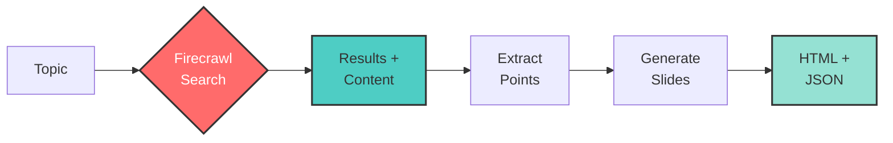

# Search to Slides

Create presentation slides from search results using Firecrawl's search endpoint.

## How it Works



## Quick Start

1. Install dependencies:
```bash
npm install
```

2. Set up API keys in `.env`:
```
FIRECRAWL_API_KEY=your_firecrawl_api_key
OPENAI_API_KEY=your_openai_api_key
```

3. Run:
```bash
npm start
```

Enter a search query when prompted to generate presentation slides.

## Get API Keys
- Firecrawl: https://firecrawl.dev
- OpenAI: https://platform.openai.com

## Features
- Auto-generated presentation slides
- Search-powered content creation
- Interactive HTML slideshow
- Export to JSON outline
